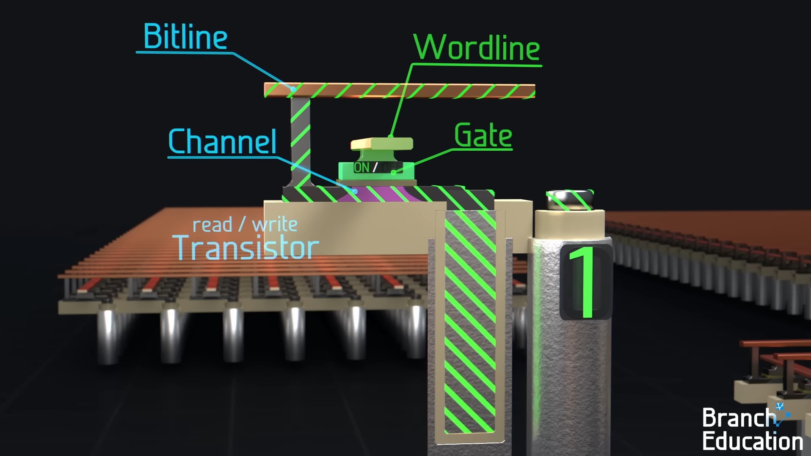
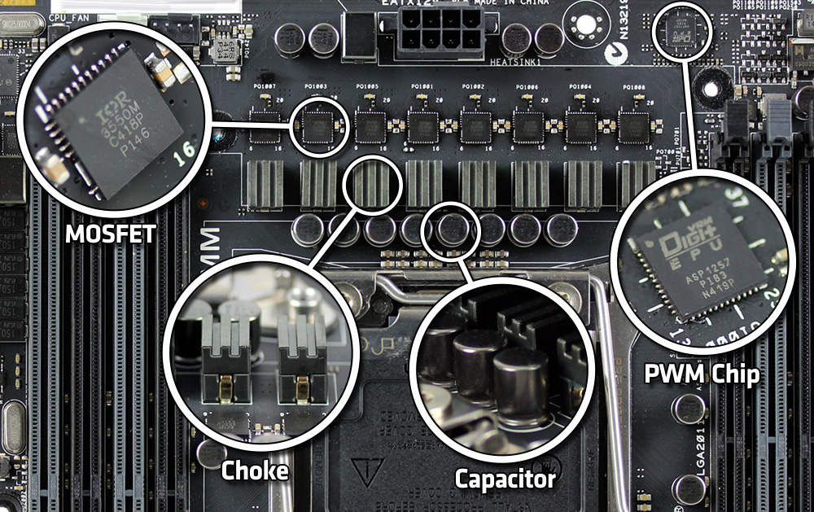
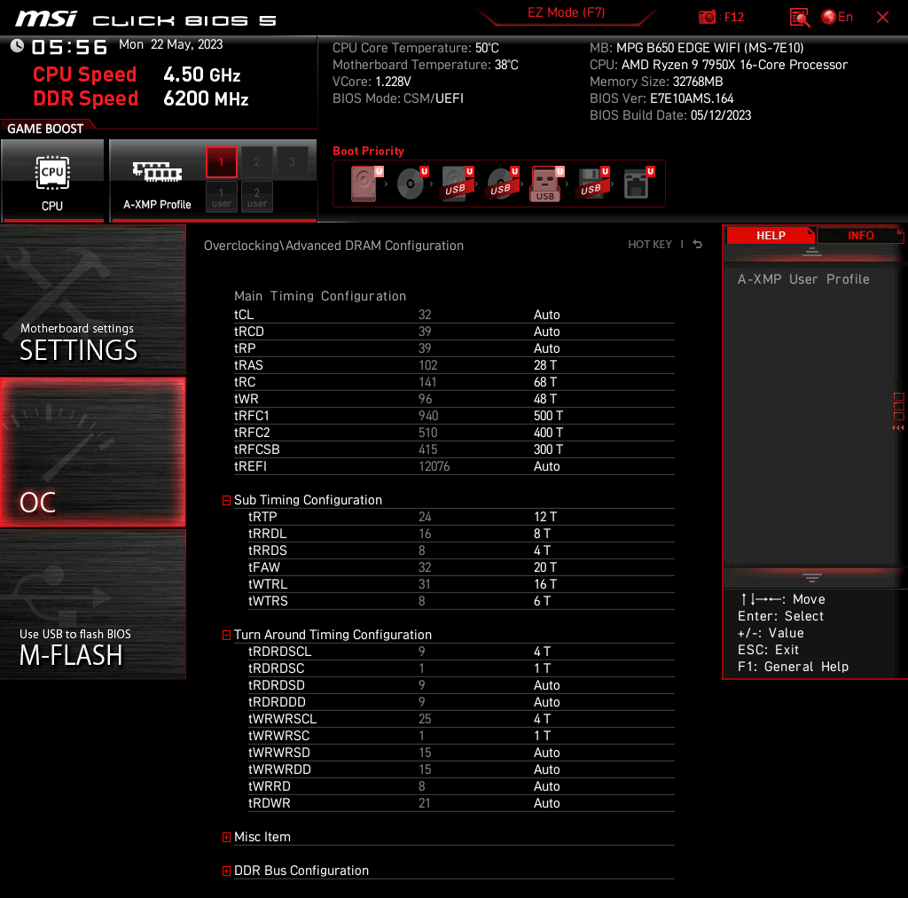
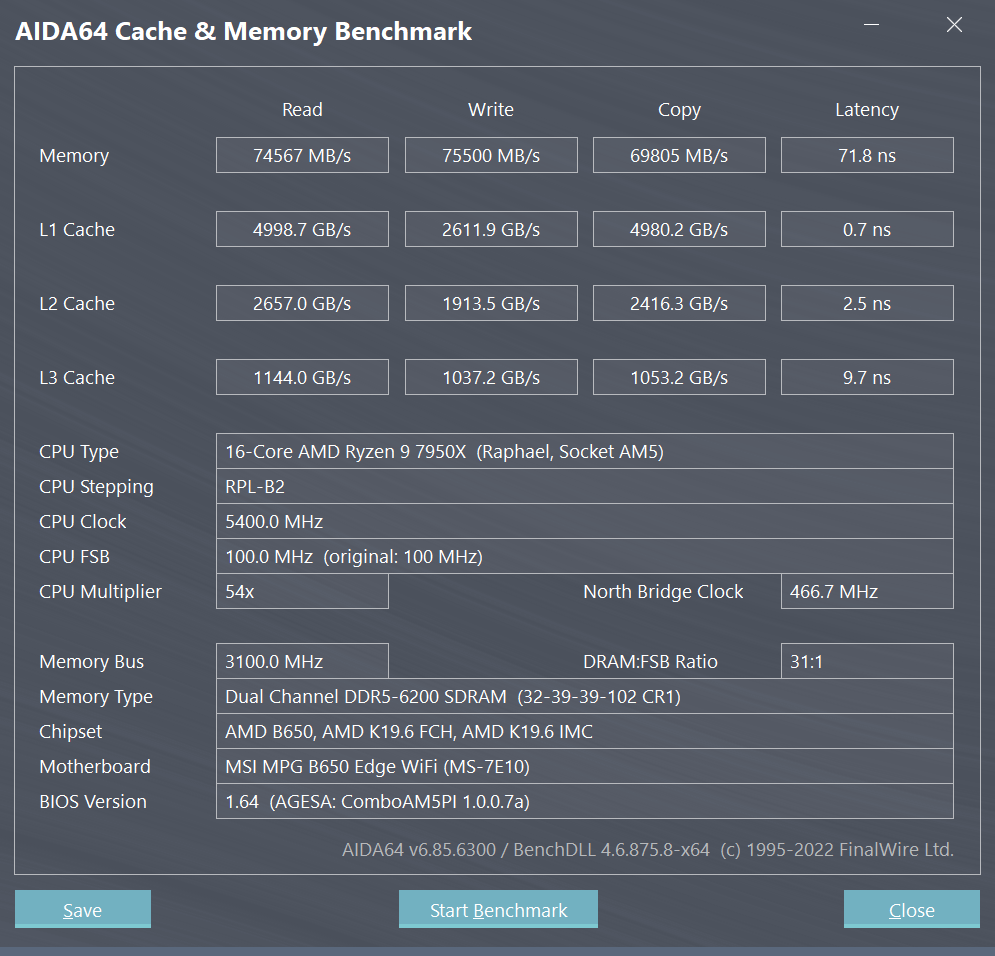
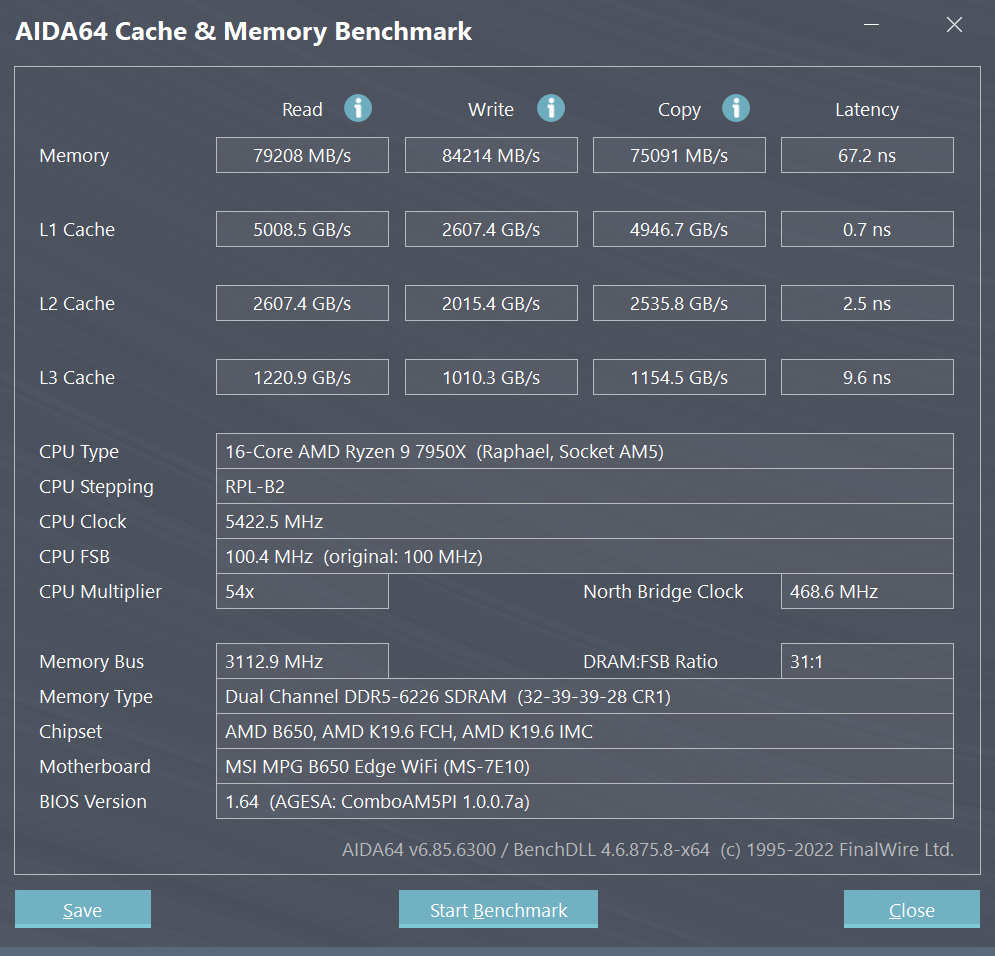

### ❀非100%教程！部分内容仅算作搬运整理
### ❀超频有损坏软件的风险，乱超频有损坏硬件+失去保修的风险；谨慎操作，自负盈亏
### ❀确保系统硬件能通过Cinebench，[Intel Burn Test](https://intelburntest.en.lo4d.com/windows)，[Furmark](https://geeks3d.com/furmark)等烤机测试，最好整点大型游戏（测试USB总线与CPU同时负载）以确保系统几乎不可能死机，然后再考虑内存超频
 - 如果还没买内存（或主板），建议先看 [上期教程-内存购买前的超频教程](https://github.com/iAvoe/Mem-Pre-Purchase-OC-Tutorial)

-----

### 工作频率

**FCLK：** Infinity-Fabric总线频率  
**MCLK：** DIMM频率  
**MCCLK：** 内存控制器MC频率  

ZEN4分离了MCCLK与FCLK之间的工作频率（见[Decoupled clocks](https://hothardware.com/news/amd-addresses-zen-4-memory-oc-details)），因此：
 1. FLCK的2000~2133Mhz与MCCLK无关
 2. 和ZEN3不同，ZEN4的FCLK，MCCLK与MCLK不可达成1:1:1频率同步
 3. MCLK 6000MT/s下，FCLK的最佳频率只有2033Mhz，设定更高频率会损失性能

### 内存控制器

**Memory Controller（MC）：** ，位于处理器上，真正执行内存操作的芯片
 - 控制器越多则成本越高，但支持的内存条通道及数量就越多
 - MC品质好则同频率下越稳定，或支持的内存运行频率越高

**Raptor-Lake MC** 支持的DDR5频率更高，但在不同主板与DIMM上可复现 [随机间歇性内存错误问题](https://www.youtube.com/watch?v=5R8en_FtA80)
 - 为安全，建议跑3小时的各种压力测试来验证内存稳定，或降低内存频率使用

**ZEN4 MC** 支持的DDR5内存频率上限仅6200MT/s，但因没有MC抽风问题，所以Buildzoid总结只要跑个10分钟测试结果正常，就代表超频成功了
 - 6400MT/s后台运行聊天软件+做种，前台写写文档还可以，但一跑MemTest就会露馅

### 内存结构

<b>DIMM（内存条） > Rank（分阶/分簇） > DRAM（内存芯片） > Bank（分库） > Cell（内存单元）</b>
 

**分库Bank：** 由对应的一套操作列和缓存行组成的小分区，位于内存芯片DRAM内，DDR3的DRAM中有8个分库，DDR4中有16个分库，每四个一组，一组分库叫Bank Group
 - DDR5有32个分库

**分阶Rank：** 一簇DRAM芯片，常见的2Rx4、2Rx8中的R，一般PCB一侧为一个Rank
 - 同DIMM里，DRAM越多，Rank则越多，处理器能用的Bank就越多，性能越高，造价越高
 - 4RxN的DIMM存在但少见，可能在HPC服务器中能找到

**缓存行Column/纸线Wordline：** 读写数据的位置，位于内存芯片DRAM内，分库中的操作列下  
**操作列Row/笔线Bitline：** 简单地说，操作信号进入对应缓存行前要流经的"树干"，位于内存芯片DRAM内  

<b>Wordline和Bitline是微观/电路上连接每个内存单元，从而构成"缓存行"和"操作列"的结构</b>
 

 - 每条Wordline横向连接着分库中的内存单元行（中的晶体管开关），负责启用/关闭Bitline连接到内存单元（中代表0和1电容）。如果失效，则Bitline无法读写内存单元的状态，或者会写入/读取进错行的内存单元中（的存储电容） 
   - 晶体管=Transister，电容=Capacitor，所以叫1T1C单元
   - 目前1T1C结构已被淘汰，但这种单元结构简单，便于举例：

 - 映射到日常生活中就是"备纸"的工作，包括Precharge，Activate，R/W等命令都能够逐一对应抽象以"收纸，取纸，擦写"的人类动作，因此译作"纸线"
 - 纸线Bitline纵向连接着分库中的内存单元列，负责读写。因人有眼而不用笔读，译作"笔"故差些意思，但"笔"和"纸"的级别关系，先后顺序，出错逻辑（纸出错vs笔出错的影响范围）等性质能在DRAM中一一对应起来，且没有为了翻译精准而使用生僻字，足够简单好记
 - 如图，纸线Wordline通电后，图中1T1C的栅极被接通，笔线Bitline就可以访问右下侧的电容了

### 内存操作

**Prechange初始化：**  
 - 笔线操作完当前缓存行后如要切换到另一行内存单元读写，就将当前行纸线断电
 - "断电"代表由纸线电压打通的晶体管关闭，使笔线与该行内存单元的电容断线
 - "断电"的原因是笔线纵向连接着分库内所有的内存单元，而一次读写访问了错误的内存单元会造成数据错误，导致各种内存相关的蓝屏死机
 - "断电"时，内存单元的状态（电容电量）不变
 - 关闭当前行是因为笔线连接着所有纵行的内存单元，所以
**Activate启用：** 紧接着Precharge完成后，打开另一缓存行进行读写的步骤  
**Refresh刷新：** 给整个Rank中的DRAM"充电"，保证每个内存单元的数据不受时间变化而流失  
 1. 这个步骤会用到笔线上连接的感应放大器来将当前缓存行中，单元电容的电压"二值化"
 2. 得到原本是0或者1后"刷写"
 3. 当前行Precharge，下行Activate，然后重复1~2，直到当前分库完成刷新
 4. 在下一个分库中重复1~3
 - 这个步骤会造成一定内存延迟，因此1Rx16会比2Rx8慢10%~20%，因为多个Rank的刷新能错开，本要等待的写入操作可以切换Rank完成，叫做Memory Interleaving

### 数据单位

Double-Data-Rate设备的 *"时钟周期数"* 双倍于运行频率工作，故不用MHz，GHz来描述其运行速度
正确的单位是单位T（周期数）代表MCLK的频率数量，除以秒得到T/S，KT/S，MT/S的频率单位
 - 3200MT/S-->1600MHz（DDR，1/2）
 - 3200MT/S-->0800MHz（QDR，1/4）

Buildzoid推荐用Mbps，Gbps来代替MT/S，GT/S表示内存速度
 - 6000MT/S-->6000Mbps（DDR，1/1）
 - 6000MT/S-->6000Mbps（QDR，1/1）

-----

### 前期工作
 1. 学会DDR5内存区别于DDR4的安装方式
 2. 如果已经调整过BIOS设定，则应保存一份副本
 3. 装好系统，确保驱动/固件/BIOS全部更新到位
 4. 至少在XMP/EXPO预设下能通过5轮MemTest测试
 5. 主板的快速启动功能默认跳过读写预习训练Training，故建议在初次超频时关闭fastboot
   - 一般在主板高级菜单中的BIOS或Boot菜单里，如下图：
 

-----

### 电压

**漏极Drain/漏极电压Drain Voltage（VDD）：** 此处指主板金属氧化物场效应晶体管MOSFET中，源极Source，漏极，栅极Gate三（或4）针之一，栅极=高频开关，源极=电源（电脑上是12V），漏极=取电（输出1.xV）
 - 漏极输出连接着CPU或DIMM，拉取的电压越大，通给芯片的电压就越大
 - 供电抵达SoC或DRAM前，还要穿过几层基板（处理器或内存的PCB），因此一般电脑的VDD电压要比核心/封装层电压高0.2~0.6V
   - 多出来一个"D"不是直流电的意思 ~~大概单纯是为了和VCC，VSS，VTT在重复发音上"押韵"~~

**ZEN4平台（Buildzoid推荐）**  

| 设定                 | 翻译                        | 体质一般   | 体质较差或2x32GB |
|----------------------|-----------------------------|------------|------------------|
| CPU Core Voltage     | 核心电压                    | 1.3V或自动 | 1.376V或自动     |
| CPU SoC Voltage      | 封装层电压                  | 1.21V      | 1.28V            |
| CPU VDDSoC Override  | 封装输入/漏极电压        | 1.25V      | 1.25V            |
| CPU VDDIO/MC Voltage | 核心内存控制器输入/漏极电压 | 1.35V      | 1.35V            |
| DRAM VDD Volage      | DRAM漏极电压            | 1.35V      | 1.37~1.39V       |
| DRAM VDDQ Voltage    | DRAM Q针脚/输出端漏极电压 | 1.35V      | 1.37~1.39V       |

 - 如果设定过了PBO超频，则应保持CPU Core Voltage设置为自动
 - **注意：** 不同主板厂商的电压命名方式不同，找不到选项时记得看说明和逐字查找

**集电极Collector/集电电压Col. Voltage（VCC）：** 在电脑上和"VDD"电压完全相同，在电气学上是把MOSFET换成了双极性晶体管BJT，名字换成射极Emitter，基极Base和集电极Collector。
 - BJT功耗更高，但比MOSFET更适合放大电流，所以常见于音响功放，电视信号功放等放大电路中
 - ~~因奈特莉~~Intel做处理器的年头久了，所以继续叫VCC可能是一种情怀

**Alder-Lake，Raptor-Lake平台（Buildzoid推荐）**  

| 设定与全名                                                   | 翻译/说明                                       | 体质一般      | 体质差 (安全极限)  |
|--------------------------------------------------------------|-------------------------------------------------|---------------|--------------------|
| **VCCIN:** Eventual CPU Input Voltage                        | 同VDD，通往VCCSA和CPU VDDQ                      | 2V            | >VCCSA, CPUVDDQ    |
| **VCCSA:** System Agent Voltage                              | CPU基础设施电压 (核心，RingBus，PCIE控制器等)   | 1.35V         | 1.45V              |
| **VCCIO/VTT/QPI:** I/O (IMC) Voltage   (A/D)                 | 内存控制器电压 (交流/直流电)                    |               |                    |
| **CPU VDDQ/VDDQTx**/(技嘉BIOS的DRAM   VDD/VDDQ是瞎写)        | 内存控制器Q针脚/输出端电压 (?)                  | 1.3V          | 1.45V              |
| **VPP/VPPM:** Wordline Voltage                               | 内存缓存行/字节线电压，影响读取操作，与超频无关 | 1.9V (>VDDR)  | 2V (>VDDR)         |
| *DDR5*                                                       |                                                 |               |                    |
| **CPU VDD2:**                                                | 内存与内存控制器的OSI物理层电压(DDR5)           | 1.45V         | 1.6V               |
| **RAM VDDQ:**                                                | DRAM Q针脚/输出端漏极电压                       | 1.5V          | 1.6V (主动散热)    |
| **RAM VDD:**                                                 | DRAM漏极电压                                    | 1.55V         | 1.6V               |
| *DDR4*                                                       |                                                 |               |                    |
| **VDDR/Memory Voltage:** RAM & IMC's   Physical Layer (PHY)  | 内存与内存控制器的OSI物理层电压                 |               | 1.6V               |
| **VTTDDR:** Memory Termination   Voltage                     | MC→内存间的中介供电，限制最低信号输入电压用     | VDDR÷2        | VDDR÷2             |

 - [Buildzoid DDR5-7000 1Rx16超频结果](https://www.patreon.com/posts/74008621)
 - [Buildzoid Intel 主板供电原理](https://youtu.be/WXhrQfXUYyw)
 - [Buildzoid Alder-Lake BIOS电压设置](http://buildzoid.blogspot.com/2022/03/12th-gen-intel-memory-overclocking.html)

-----

### 时序（附海力士/Hynix DRAM预设）

 - 根据Buildzoid，本超频预设是为了进一步根据自己情况优化的"起点"，而非"终点"（将就着用也不是不行）
 - Buildzoid测试了Hynix A-die，M-die等多个2x16GB DIMM，DRAM；ASUS，AsRock，Gigabyte等厂商的主板；分别在HCI MemTestPro（2000%覆盖）和y-Cruncher（3.5小时）上正常通过了压力测试后确认了其稳定性
   - 本文作者使用MSI B650 Edge主板，通过了Memtestpro，几个月下来没有遇到问题
 - 超频前后结果见本页底部
 - 手机端需要右划屏幕才能看到表格右侧

| 一级/主时序              | 全拼                                       | 说明                                            | Buildzoid推荐       | 小道消息          |
|--------------------------|--------------------------------------------|-------------------------------------------------|---------------------|-------------------|
| **tCL**                 | Column Access Strobe Latency               | MC启用，定位指针到分库内操作列的延迟            | 沿用XMP/EXPO        | 28~30 T           |
| **tRCD   R/W**          | Row Access Strobe Read/Write   Latency     | MC将指针进入操作列下任意缓存行，执行读/写的延迟 | 沿用XMP/EXPO        |                   |
| **tRP**                 | Row Precharage Time                        | 同阶/Rank芯片内，关一行+启用+初始化另一行的延迟 | 沿用XMP/EXPO        |                   |
| **tRAS**                | Row Activation Time                        | 启用+初始化任意缓存行的延迟                     | 28 T(部分BIOS限30)  | tRCD+tRTP         |
| **CR**                  | Command Rate                               | 内存控制器指令发送频率                          | 自动/1 T/2 T        | 1 T               |
| *1.5(MSI主-ASUS子)*      |                                            |                                                 |                     |                   |
| **tRC**                 | Row Cycle Time                             | 启用→启用命令间隔延迟                           | 68 T (偏松)         | 48 T (tRAS+tRP)   |
| **tWR**                 | Write Recovery Time                        | 写→启用命令间隔延迟                             | 48 T (偏紧)         |                   |
| **tRFC1**               | Refresh Cycle Time                         | 刷新+启用命令间隔延迟                           | 500 T(M-die偏松)    | 490 T (M-die偏松) |
| **tRFC2x**              | 2x Refresh Cycle Times (FGR)               | 双重刷新+启用命令间隔延迟                       | 400 T(M-die偏松)    | tRFC÷1.346        |
| **tRFC4x**              | 4x Refresh Cycle Times (FGR)               | 四重刷新+启用命令间隔延迟                       |                     | tRFC÷1.625        |
| **tRFCSB**              | Bank Refresh Cycle Time                    | 刷新整个分库/Bank的命令延迟                     | 300 T(M-die偏松)    |                   |
| **tREFI/Refresh   Int.** | Refresh Interval Time                      | 刷新→刷新间隔延迟                               | 50000(偏松，低收益) | 44000 T           |
| *二级/子时序*            |                                            |                                                 |                     |                   |
| **tRTP**                | Read Precharge Delay                       | 读→初始化命令间隔延迟                           | 12 T(M-die偏松)     | 8 T               |
| **tRRDL**               | RAS to RAS Delay Inside-Bank               | 初始化→初始化命令间隔延迟                       | 8 T (偏紧)          | 7 T               |
| **tRRDS**               | RAS to RAS Delay Outside-Bank              | 初始化→初始化命令间隔延迟                       | 4 T(tFAW÷4)         |                   |
| **tFAW**                | Four Activate Window                       | MC一次启用四行缓存行的命令延迟                  | 20 T(锐龙MC极限)    |                   |
| **tWTRL**               | Write to Read Delay Inside-Bank            | 同分库，跨操作列的写→读间隔延迟                 | 16 T                |                   |
| **tWTRS**               | Write to Read Delay Outside-Bank           | 跨DRAM，同DIMM阶/Rank的写→读间隔延迟            | 6 T                 |                   |
| **tCWL**                | Column Access Strobe Write   Latency       | MC启用，写入到分库内操作列的延迟                | 沿用XMP/EXPO        | tCL-1或-2，偶数   |
| *数据周转时序*           |                                            |                                                 |                     |                   |
| **tRDRDSCL**            | 2 Rows Read to Read Delay   Inside-Bank    | 跨操作列，同分库的读→读间隔延迟                 | 4 T (偏紧)          |                   |
| **tRDRDSC**             | 2 Rows Read to Read Delay   Outside-Bank   | 跨分库，同DRAM的读→读间隔延迟                   | 1 T (紧)            |                   |
| **tRDRDSD**             | 2 Rows Read to Read Delay   Outside-Rank   | 跨阶，跨DRAM，同DIMM的读→读间隔延迟             | Auto                |                   |
| **tRDRDDD**             | 2 Rows Read to Read Delay   Outside-DIMM   | 跨DIMM读→读间隔延迟                             | Auto                | == tWTRS          |
| **tWRWRSCL**            | 2 Rows Write to Write Delay   Inside-Bank  | 跨操作列，同分库的写→写间隔延迟                 | 4 T (偏紧)          |                   |
| **tWRWRSC**             | 2 Rows Write to Write Delay   Outside-Bank | 跨分库，同DRAM的写→写间隔延迟                   | 1 T (紧)            |                   |
| **tWRWRSD**             | 2 Rows Write to Write Delay   Outside-Rank | 跨阶，跨DRAM，同DIMM的写→写间隔延迟             | Auto                |                   |
| **tWRWRDD**             | 2 Rows Write to Write Delay   Outside-DIMM | 跨DIMM写→写间隔延迟                             | Auto                | == tWRRD          |
| **tWRRD**               | Write Read Command Turn-Around   Delay     | 写→读命令间隔延迟                               | 2 T                 |                   |
| **tRDWR**               | Read Write Command Turn-Around   Delay     | 读→写命令间隔延迟                               | 16 T                |                   |

**MSI主板设置图例：**

-----

### DDR5 ODT阻抗设置（仅小道消息）

**末端电阻ODT：** 见[上期教程-内存购买前的超频教程](https://github.com/iAvoe/Mem-Pre-Purchase-OC-Tutorial)  

**阻抗Impedance：** 信号强度需求。如果生成信号的强度不足，则信号无法被正确识别（此处被末端电阻拦截）；强度过高则会因为阻抗Ω = 电压 V÷ 电流 A的关系而造成的高电压破坏，类似落地式音箱功放烧坏低阻抗耳机的情况  

| 末端电阻       | 全拼                                      | 翻译                                            | 小道消息           |
|----------------|-------------------------------------------|-------------------------------------------------|--------------------|
| **ProcODT**   | Processor On-die-termination   Impedance  | CPU末端电阻器阻抗(主要信号强度)                 | 28~75Ω(更高需风冷) |
| **ProcCaDs**  | *Unknown*                                 | *未知*                                          | 30Ω                |
| **ProcDqDs**  | *Unknown*                                 | *未知*                                          | 48Ω                |
| **DRAMDqDs**  | *Unknown*                                 | *未知*                                          | 40Ω                |
| **RTTPark**   | Park O.D.T. Strength/Impedance            | 末端电阻器低开，DRAM待启用，数据暂留状态阻抗(?) | RZQ÷5~RZQ÷7        |
| **RTTParkDqs** | Park O.D.T. Strength/Impedance            | 末端电阻器低开，DRAM待启用，数据暂留状态阻抗(?) | RZQ÷5~RZQ÷6        |
| **RttNomRD**  | Nominal O.D.T. Read   Strength/Impedance  | 末端电阻器高开，DRAM待启用，数据待读状态阻抗(?) | RZQ÷6              |
| **RttNomWR**  | Nominal O.D.T. Write   Strength/Impedance | 末端电阻器高开，DRAM待启用，数据待写状态阻抗(?) | RZQ÷7              |
| **RttWR**     | Dynamic O.D.T.   Strength/Impedance       | 末端电阻器写入专用阻抗                          | RZQ÷6~RZQ÷7        |

-----

### 时钟信号发生器ClkDrv设置（仅小道消息）

| 时钟信号发生器       | 全拼                                          | 翻译                                                 | 小道消息       |
|---------------------|-----------------------------------------------|------------------------------------------------------|----------------|
| **ClkDrv(Str)**    | Clock Driver Strength/Impedance               | 时钟信号发生器阻抗(信号强度)                         | 跑不过测试时+1 |
| **AddrCmdDrv(Str)** | Address / Command Driver   Strength/Impedance | 内存命令发生器阻抗(主要信号强度)                     | 跑不过测试时+1 |
| **CsODTDrv(Str)**  | Chip/Slave Select O.D.T.   Strength/Impedance | 片选信号末端电阻器阻抗(区分同线路上连接的芯片类型用) | 过POST失败时+1 |
| **CkeDrv(Str)**    | Clock Enabler Drive   Strength/Impedance      | 内存时钟开启器阻抗(信号强度)                         | 跑不过测试时+1 |

-----

### 测试性能

 - 为确保万无一失，无论如何都要跑点什么内存测试来验证一下
 - 有HCI MemTestPro，y-Cruncher，AIDA64等工具可用
 - 建议不要用对内存压力偏低的Cinebench等CPU测试软件

### 超频前后对比

 - 使用了锐龙7700X，B650平台，F5-6400J3239G16G内存（6200MT/s 2x16GB 32-29-29-102 CR1T），AIDA64的内存跑分功能
 - **超频前：**

 - **超频后：**

-----

**关于DDR5的ECC校验：** DDR5内存比DDR4桌面端强在使用了On-die ECC校验，但和真的ECC芯片原理/Off-die ECC不同，是多装了颗内存芯片来实现的，所以内存超频后的校验效果存疑  

**主要资料来源：**
 - [Buildzoid/AHOC](https://www.youtube.com/watch?v=dlYxmRcdLVw&ab_channel=ActuallyHardcoreOverclocking)
 - [Reddit (DELETED USER)](https://old.reddit.com/r/overclocking/comments/ahs5a2/demystifying_memory_overclocking_on_ryzen_oc/)
 - [TechSpot deadfellow.480348](https://www.technopat.net/sosyal/konu/ddr5-hynix-ram-overclock-degerleri-nasil.2456291/)
 - [Reddit u/rainmakesthedaygood](https://www.reddit.com/r/overclocking/comments/11mgqts/how_low_can_i_go_with_trfc_trfc2_and_trfcsb_on/)

那么就这样吧。
